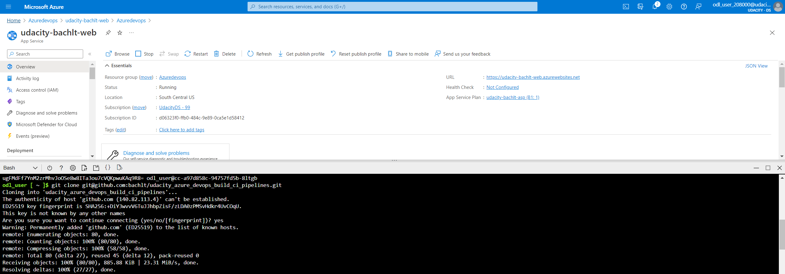
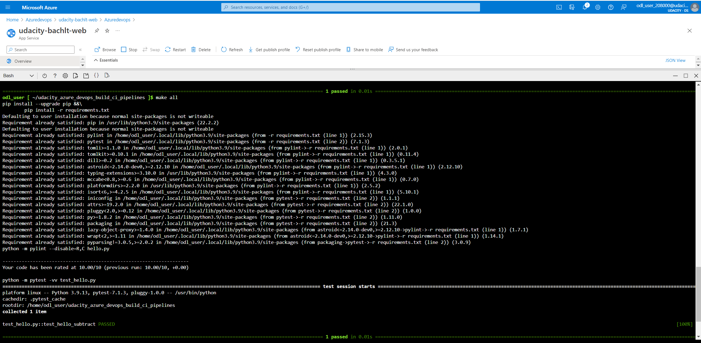
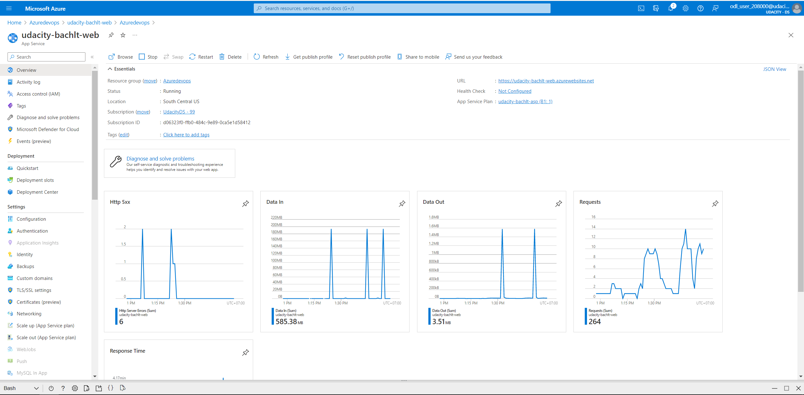
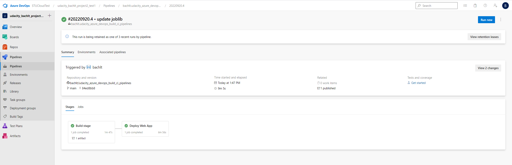
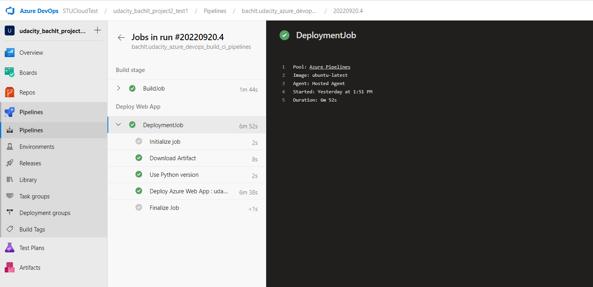
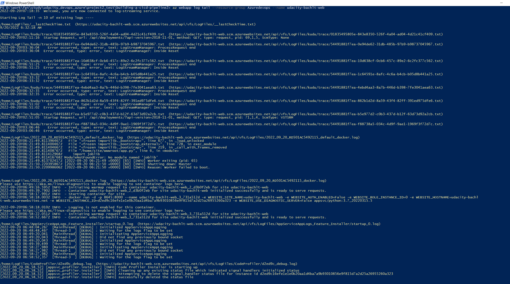
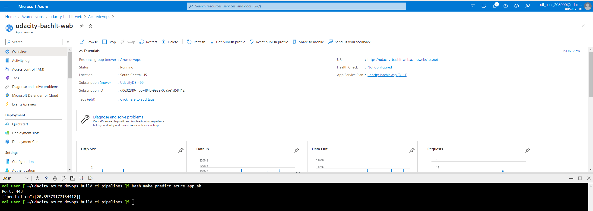
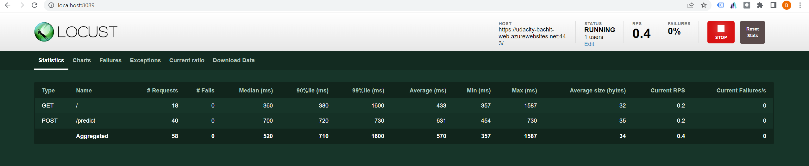

# Building a CI/CD Pipeline

## Introduction
This project contains a python application to predict housing prices. This repo included:
- Deploy the app in Azure CloudShell
- Deploy the app as an Azure App Service

## Architecture Diagram
- Developer commit source code to github in feature branch.
- Reviewer will merge commit to main branch.
- Github action will be triggered to verify commit
- Azure pipeline also be triggered to build source code to zip file and deploy to Azure App service.

- A [Trello](https://trello.com/b/BHbvpAav/udacity-bachlt) board to manage task for member.
- A [spreadsheet](project_schedule.xlsx) to manage project schedule.
- A [Demo Youtube](https://youtu.be/k6yUoqCteqM) to demo our project.

## Set Up Azure Cloud Shell
- Create udacity account by clicking access lab OR use your own account
- Create storage account ==> for create azure cloudshell
- Gen ssh key and integrate to github
- Clone project by cmd: git clone git@github.com:bachlt/udacity_azure_devops_build_ci_pipelines.git
 
- Run test make all
 

## Deploy Webapp by Azure pipeline
- Create App service plan and app service in Azure portal
 
- Create Project in Azure devops
- Create Service connection to Azure portal
- Create github connection
- Create Pipeline by existing yaml file in project.
- Run pipeline to deploy Web app to App Services.

- Check log web app

- Test deploy webapp successfully by run file make_predict_azure_app

## Load test by Locust
- Install Locust by cmd: pip install locust
- Run Locust and test our web app by cmd: locust
- Check report on localhost:8089

## Improvement
- This project is only have single branch for 1 developer. In reality, the project have many branch for all develop team to contribute source code. We have to improve source code management, branch of pipeline trigger, how to merge code to staging and production environment etc..

